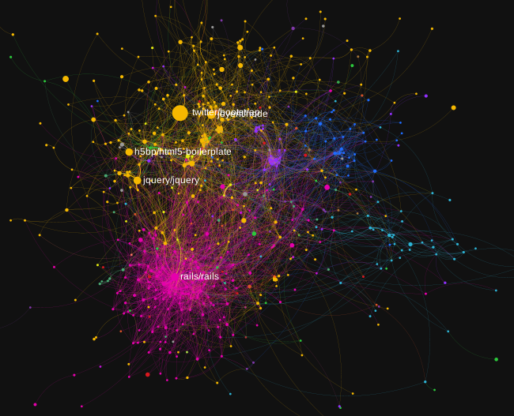

GitHub Repository Collaboration Network Analysis
===

An analysis and visualization of collaboration between top GitHub repositories,
focused on the relationship between programming languages used and the network
structure.

**Interactive visualization:**

**More information and the full analysis: [PDF report](github.pdf)**

My final project for [Social Network Analysis](https://www.coursera.org/course/sna),
and entry in the [GitHub Data Challenge](https://github.com/blog/1450-the-github-data-challenge-ii).

Credit to [@frewsxcv](https://github.com/frewsxcv) and [@ThePicard](https://github.com/ThePicard) for their help.

General workflow
---

 * From Google BigQuery:
    * repo-attributes.sql creates repo-attributes.csv
    * repo-weights.sql creates repo-weights.csv
 * The process.py script reads both .csv files and creates repositories.gml
 * Gephi loads repositories.gml and creates:
    * repositories\*.pdf to be included in the report
    * [repositories.json](../gh-pages/repositories.json) for sigma.js
 * Python code within analysis-\*.texw reads repositories.gml and produces
   output for the report
